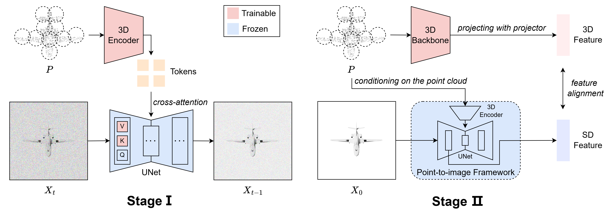

# PointSD

# [ICCV 2025] Harnessing Text-to-Image Diffusion Models for Point Cloud

By Yiyang Chen, Shanshan Zhao, Lunhao Duan, Changxing Ding and Dacheng Tao

This is the official implementation of "Harnessing Text-to-Image Diffusion Models for Point Cloud"
[[arXiv]](https://arxiv.org/abs/2507.09102)



## Installation

```
# Quick Start
conda create -n pointsd python=3.9 -y
conda activate pointsd

# Install pytorch
pip install torch==2.0.1 torchvision==0.15.2 torchaudio==2.0.2

# Install required packages
pip install -r requirements.txt
```
```
# Install fine-tune requirements
cd ./Point-MAE
pip install -r requirements.txt

# Install the extensions
# Chamfer Distance
cd ./extensions/chamfer_dist
python setup.py install --user
# PointNet++
pip install "git+https://github.com/erikwijmans/Pointnet2_PyTorch.git#egg=pointnet2_ops&subdirectory=pointnet2_ops_lib"

# Go back to the project root directory
cd ../../../
```

## Datasets
See [DATASET.md](./DATASET.md) for details.

## Stable Diffusion Checkpoint
We use SD-v1.5 to conduct experiments and you can download the checkpoint [here](https://huggingface.co/stable-diffusion-v1-5/stable-diffusion-v1-5).

## PointSD Models
| Task              | Dataset        | Config                                                               | Acc.       | Download                                                                                     |
|-------------------|----------------|----------------------------------------------------------------------|------------|----------------------------------------------------------------------------------------------------------|
| Pre-training      | ShapeNet       | [train_pointsd.sh](./train_pointsd.sh)                        | N.A.       | [Pre-train](https://drive.google.com/drive/folders/1Yvu4fxFwKJoYn_8K2782p9bqqeHrBRX_)           |
| Classification    | ScanObjectNN   | [finetune_scan_objbg.yaml](./Point-MAE/cfgs/finetune_scan_objbg.yaml)     | 95.18%     | [OBJ_BG](https://drive.google.com/drive/folders/10cIUm8v7o1tAKBMuTeNUATzMu8PdY96L)          |
| Classification    | ScanObjectNN   | [finetune_scan_objonly.yaml](./Point-MAE/cfgs/finetune_scan_objonly.yaml) | 93.63%     | [OBJ_ONLY](https://drive.google.com/drive/folders/1bKFLQU3GRT5heUJ8VU1AEIiZq_J1sCur)        |
| Classification    | ScanObjectNN   | [finetune_scan_hardest.yaml](./Point-MAE/cfgs/finetune_scan_hardest.yaml) | 90.08%     | [PB_T50_RS](https://drive.google.com/drive/folders/1EXnPIySeGsK1hYYG8poq1Sv1Z6M88C8h)       |
| Classification    | ModelNet40 | [finetune_modelnet.yaml](./Point-MAE/cfgs/finetune_modelnet.yaml)         | 93.7%      | [ModelNet40](https://drive.google.com/drive/folders/1k0SHUWosTS93Gddq7RH753ga2-PU6i_x)     |

| Task              | Dataset    | Config                                   | 5w10s | 5w20s | 10w10s | 10w20s | Download                                                                                       |
|-------------------|------------|------------------------------------------|------------|------------|------------|------------|------------------------------------------------------------------------------------------------|
| Few-shot learning | ModelNet40 | [fewshot.yaml](./Point-MAE/cfgs/fewshot.yaml) | 97.7 ± 1.8% | 99.0 ± 0.9% | 93.8±3.6% | 95.9±2.6% | [FewShot](https://drive.google.com/drive/folders/1S_QXbWf_aseFyaUqqi8WNqwLPT8jZ79S) |

| Task              | Dataset      | Config                                      | Cls.mIoU | Insta.mIoU | Download                                                                                     |
|-------------------|--------------|------------------------------------------|------------|------------|------------|
| Segmentation | ShapeNetPart | [segmentation](./Point-MAE/segmentation) | 84.5%  | 86.1% |[Segmentation](https://drive.google.com/drive/folders/1LNct2kQJSyVGohJQ06cIL_G_iVOhfcg7)|

## Pre-training
To pre-train PointSD, you need to set `task_name`, `model_dir`, `dataset_dir` and `img_dir` in `train_pointsd.sh`. For the first training stage, you need to set `run_stage` to `stage1` and then run:
```
bash train_pointsd.sh
```
For the second training stage, you need to set `run_stage` to `stage2` and set `stage1_ckpt` to the path of the first stage checkpoint and then run:
```
bash train_pointsd.sh
```
If you use more than one gpu to run, please remember to set [`num_processes`](./accelerate_configs/zero2_config.yaml) to the corresponding number of gpus . You can use checkpoint-120000/ckpt-stage2.pt or checkpoint-best/ckpt-stage2.pt for subsequent fine-tuning.


## Fine-tuning
First, switch to the `Point-MAE` folder:
```
cd Point-MAE
```

Fine-tuning on ScanObjectNN, run:
```
# Select one config from finetune_scan_objbg/objonly/hardest.yaml
CUDA_VISIBLE_DEVICES=<GPUs> python main.py --config cfgs/finetune_scan_hardest.yaml \
--finetune_model --exp_name <output_file_name> --ckpts <path/to/pre-trained/model> --seed $RANDOM


# Test with fine-tuned ckpt
CUDA_VISIBLE_DEVICES=<GPUs> python main.py --test --config cfgs/finetune_scan_hardest.yaml \
--exp_name <output_file_name> --ckpts <path/to/best/fine-tuned/model>
```
Fine-tuning on ModelNet40, run:
```
CUDA_VISIBLE_DEVICES=<GPUs> python main.py --config cfgs/finetune_modelnet.yaml \
--finetune_model --exp_name <output_file_name> --ckpts <path/to/pre-trained/model> --seed $RANDOM

# Test with fine-tuned ckpt
CUDA_VISIBLE_DEVICES=<GPUs> python main.py --test --config cfgs/finetune_modelnet.yaml \
--exp_name <output_file_name> --ckpts <path/to/best/fine-tuned/model>

```
Few-shot learning, run:
```
CUDA_VISIBLE_DEVICES=<GPUs> python main.py --config cfgs/fewshot.yaml --finetune_model \
--ckpts <path/to/pre-trained/model> --exp_name <output_file_name> --way <5 or 10> --shot <10 or 20> --fold <0-9> --seed $RANDOM
```
Part segmentation on ShapeNetPart, run:
```
cd segmentation
python main.py --gpu <gpu_id> --ckpts <path/to/pre-trained/model> \
--log_dir <log_dir> --learning_rate 0.0002 --epoch 300 \
--root <path/to/data> \
--seed $RANDOM
```

## Acknowledgements

This codebase is built upon [Point-MAE](https://github.com/Pang-Yatian/Point-MAE), [Pointnet2_PyTorch](https://github.com/erikwijmans/Pointnet2_PyTorch), [VPD](https://github.com/wl-zhao/VPD/tree/main), [IPAdapter](https://github.com/tencent-ailab/IP-Adapter), [ULIP](https://github.com/salesforce/ULIP).

## Citation
If you find this repo useful, please cite:
  ```
@article{chen2025harnessing,
  title={Harnessing Text-to-Image Diffusion Models for Point Cloud Self-Supervised Learning},
  author={Chen, Yiyang and Zhao, Shanshan and Duan, Lunhao and Ding, Changxing and Tao, Dacheng},
  journal={arXiv preprint arXiv:2507.09102},
  year={2025}
}
```